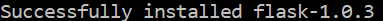
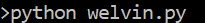
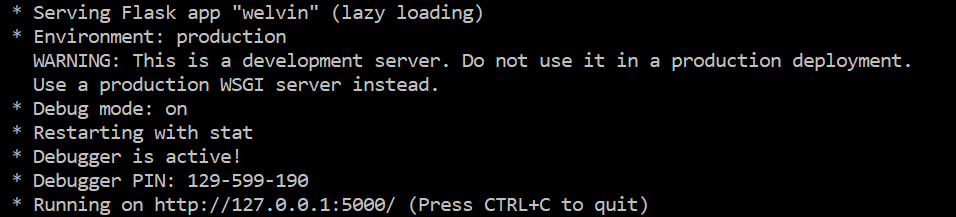
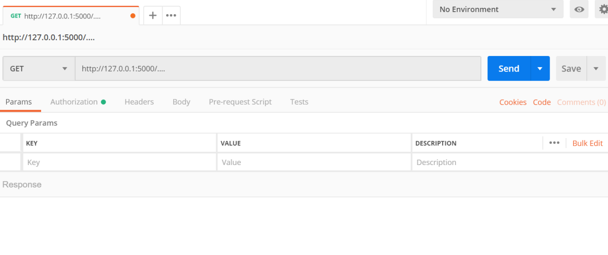
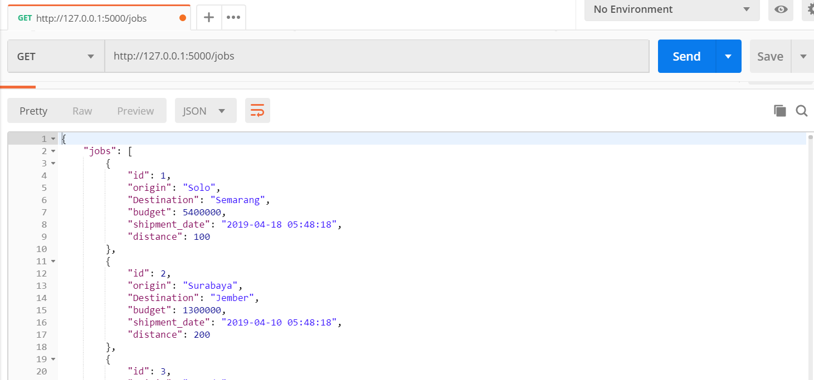
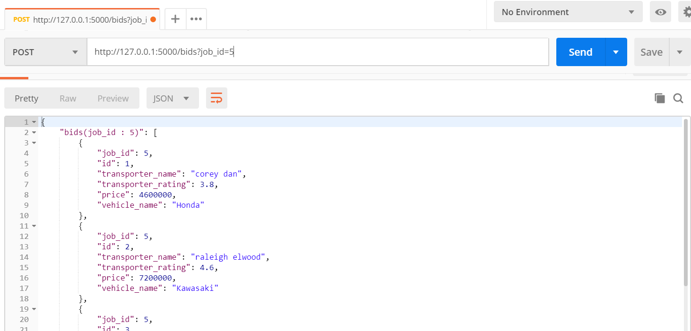
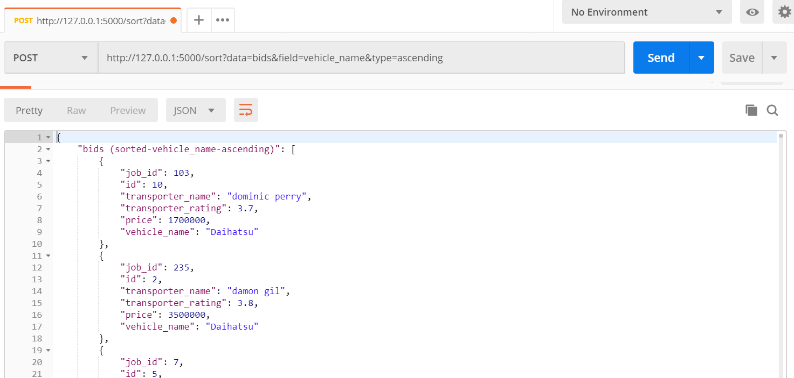

# simple_API
### Description
This is the first API I’ve ever created. I used python alongside with the flask framework in creating this simple API. I implemented two basic RESTful requests (GET and POST), which will be described further in later section. Some basic functionalities in the program itself include showing different types of data, and sorting them based on multiple fields.

### Installation

1.	Installing python on your computer

  Firstly, make sure you have python idle in your computer. Feel free to download and install it if you don’t have one (https://www.python.org/downloads/).

2.	Installing important packages

  After python is installed on your computer, you have to install necessary packages for this particular project. Open your windows command prompt (or OS X terminal for apple), and type following command:
  ```
  pip install flask
  ```

  You might get the following error : ‘pip’ is not recognized as an internal or external command. To handle this, there is something you need to do about environment variables. I suggest you to follow this simple [solution](https://appuals.com/fix-pip-is-not-recognized-as-an-internal-or-external-command/).

  The successful installation should give you this message :
  

  Don’t forget to install the following package :
  ```
  pip install flask_restful
  ```

  We will import these 2 on the source code.

3. Installing postman

  Postman is a great tool to perform HTTP requests. You can download and install [Postman](getpostman.com/downloads) or use another tool that give similar functionalities.

4. Source codes

  I provide 3 source codes and 1 text file in this repository. Feel free to clone them into your computer and make sure you put them into the same directory.


### Usage

After all requirements are set up. We can begin the API testing. Go to the windows command prompt or OS X Terminal, and type the following in the directory where you put the source codes :

 

If you follow the previous steps properly, you should get this on your screen :

 

Open the postman app, and put the http address like this :

 

Note that ‘….’ Is the app route which will be described below. Don’t write ‘….’! Instead, replace ‘….’ with specific route you want.

1.	Show list of jobs/bids
To do this, we will perform a GET request.

Add ‘/jobs’ or ‘/bids’ at the end of the HTTP URL, and you should get the list of jobs or bids respectively. Note that I have randomly generated additional jobs & bids using simple code (can be seen in data.py) .



2.	Show list of bids associated with specific job
For this, we need to perform a POST request.

 

You need to add ‘/bids?job_id=x’ where x is an integer (job_id) you want to be displayed.

3.	Sort data according to particular parameter
Lastly, for sorting purpose, we will once again use a POST request



Add ‘/sort?data=value_1&field=value_2&type=value_3’ to the HTTP URL.

Note :
Value_1 can only be valid if it is either ‘jobs’ or ‘bids’
Value_2 can only be valid if it is one of the valid key in either jobs or bids
jobs	id
	origin
	Destination
	budget
	shipment_date
	distance
bids 	id
	job_id
	transporter_name
	transporter_rating
	price
	vehicle_name

Value_3 works for either ‘ascending’ or ‘descending’. It determines how the program will sort the data.
